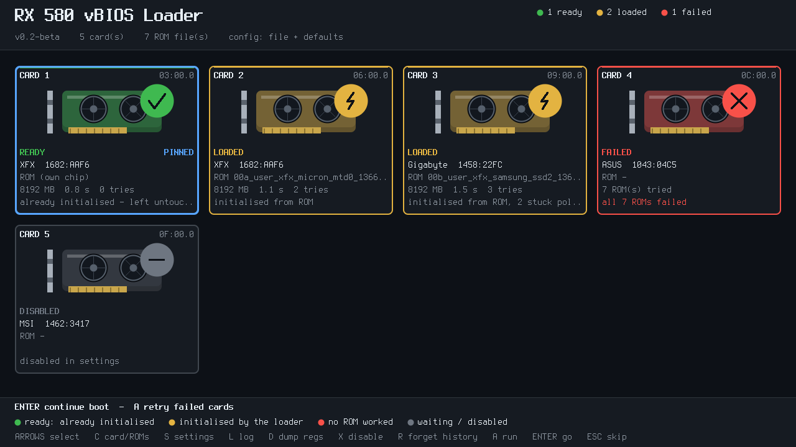
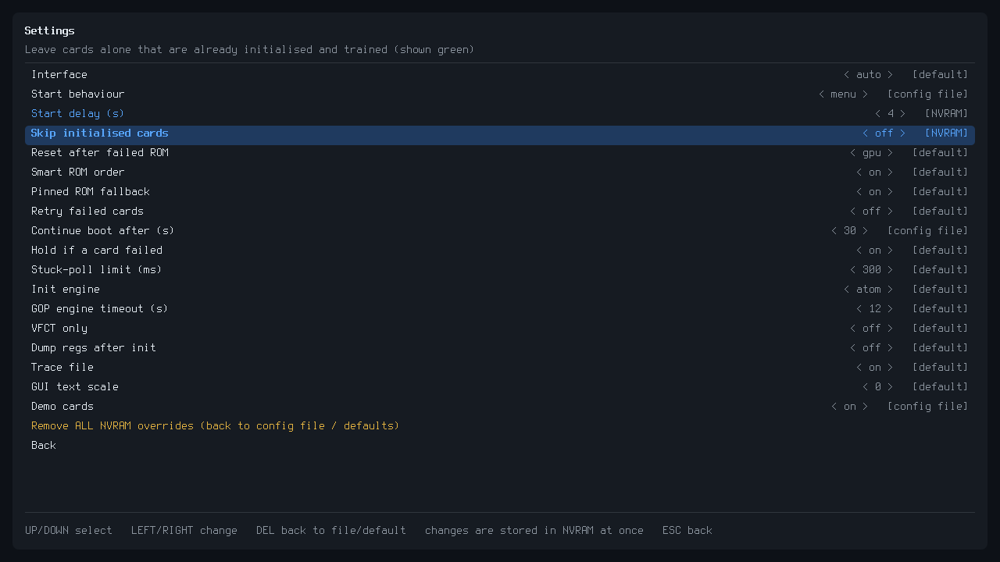

# RX 580 vBIOS Loader

A UEFI application for initializing AMD Polaris / RX 580 GPUs when their SPI vBIOS flash chip, or the electrical path to it, is unavailable.

The loader uses your own ROM files during early UEFI boot, initializes the GPUs, and can publish the selected ROMs to Linux through ACPI/VFCT.

> **Important:** This project does not include GPU vBIOS dumps, GOP images, or vendor firmware. Use your own full SPI dumps or a compatible ROM you are legally allowed to use.

## Preview

### Status



### Settings



## Quick Setup

### 1. Clone and build

```bash
git clone https://github.com/aryan-nikzad/rx580_vbios_loader_git.git
cd rx580_vbios_loader_git
sudo apt install gnu-efi build-essential
make
```

### 2. Create the vBIOS folder

Create `vbioses/` **inside the project folder**, next to `vbios_loader.efi`:

```bash
mkdir -p vbioses
```

Your project should look like this:

```text
rx580_vbios_loader_git/
├── vbioses/
│   ├── my_rx580.rom
│   ├── backup.rom
│   └── another_vbios.rom
├── vbios_loader.efi
├── install_linux.sh
└── ...
```

### 3. Using the provided RX 580 dumps

If you do not have your own ROM yet, you can use the dumps published in the companion repository:

- [RX 580 SPI vBIOS Dumps](https://github.com/aryan-nikzad/rx580_dumps)

The repository contains XFX RX 580 SPI dumps and a Gigabyte RX 580 dump that has also been tested with an XFX RX 580 in this project.

You can download individual ROM files, or simply download the repository's **`vbioses/`** folder and place that folder directly in the project root, next to `install_linux.sh`.

The resulting layout should look like:

```text
rx580_vbios_loader_GUI/
├── vbioses/
│   ├── ... .rom
│   └── ... .rom
├── install_linux.sh
└── ...
```

The installer will copy the `vbioses/` folder to the EFI System Partition together with the loader.

**Compatibility warning:** these are vendor firmware dumps, not universal RX 580 ROMs. Prefer your own original full SPI dump when available, and verify board, VRAM, memory configuration, subsystem ID, and other hardware details before using a ROM on a different card.

### 4. Add your own vBIOS

Copy one or more `.rom` vBIOS files into the `vbioses/` folder. The installer copies this folder to the EFI partition automatically.

For example:

```bash
cp /path/to/my_rx580.rom vbioses/
```

A **full SPI-chip dump** is preferred when available. Do not cut a 256 KiB hardware dump down to the smaller visible BIOS image.

You can use multiple ROMs. Different cards can use different ROMs.

### 4. Install

```bash
sudo ./install_linux.sh
```

The installer copies the loader and `vbioses/` to:

```text
EFI/vbios_loader/
├── vbios_loader.efi
└── vbioses/
    ├── my_rx580.rom
    └── ...
```

It also creates a UEFI boot entry for the loader.

The system must be booted in **UEFI mode**, with the EFI System Partition mounted at `/boot/efi` (or use `ESP=/your/efi/path sudo ./install_linux.sh`).

### 5. Disable AMD runtime power management

For cards whose physical SPI vBIOS is unavailable, Linux may later try to power-cycle and re-initialize the GPU. This can cause a freeze during desktop startup even though the loader initialized the card successfully.

Add `amdgpu.runpm=0` to the GRUB kernel command line:

```bash
sudo nano /etc/default/grub
```

For example:

```text
GRUB_CMDLINE_LINUX_DEFAULT="quiet splash amdgpu.runpm=0"
```

Then:

```bash
sudo update-grub
sudo reboot
```

After reboot, verify:

```bash
cat /sys/module/amdgpu/parameters/runpm
```

It should print:

```text
0
```

## Manual: Choose a ROM for Each GPU

The normal setup can be completely automatic. You only need to choose the ROM for each card **once**.

### First boot

After installation, reboot.

The loader shows one card for each detected GPU. Let the loader finish detecting the cards.

If you want to configure a card manually:

1. Use the **arrow keys** to select the GPU.
2. Press **C** to open that card's page.
3. Choose **one ROM** from the ROM list.
4. Use **P** to **pin** that ROM to the selected card.
5. Repeat the same steps for every GPU.

For example, if you have two cards:

```text
GPU 1  →  00_xfx.rom
GPU 2  →  01_gigabyte.rom
```

Pin the appropriate ROM to each card.

The card's PCI address is shown by the loader. This address identifies the physical card, so different cards can have different ROM assignments.

### Make it fully automatic

Once a ROM is pinned to a card, the loader remembers the assignment in UEFI NVRAM.

You do **not** need to select the ROM again on every boot.

The normal flow becomes:

```text
Power on
   ↓
RX 580 vBIOS Loader starts
   ↓
Detect cards
   ↓
Use the remembered ROM for each card
   ↓
Initialize GPUs
   ↓
Publish vBIOSes to Linux
   ↓
Continue to GRUB / Linux
```

If you have multiple cards, configure each card once and then let the loader run automatically.

### If you want to change a card's ROM

Boot the loader, select the card, press **C**, and pin a different ROM with **P**.

You can also use the settings/configuration system for permanent per-card assignments.

Example:

```text
card.03:00.0.rom=00_xfx.rom
card.06:00.0.rom=01_gigabyte.rom
```

The PCI address must match the address shown by the loader.

### Force initialization of an already-green card

By default, the loader leaves a card untouched when it detects that the GPU is already initialized and memory-trained. If you need to deliberately run AtomBIOS initialization anyway, select the card and press **F**. This setting is saved per PCI address in UEFI NVRAM, so it remains enabled on later boots.

The same setting can be written in the configuration file as `card.03:00.0.force=1`. **Force initialization is an advanced option:** re-initializing an already-working Polaris GPU can hang or corrupt its state if the ROM is incompatible.

Press **F** again to return to normal green-card detection. **X** disables a card; enabling force initialization automatically clears the disabled state.

### If you want to stop using a pinned ROM

Open the card page and use **U** to unpin the card.

The loader can then use its normal ROM selection order again.

## Loader Controls

| Key | Action |
|---|---|
| **ARROWS** | Select a GPU |
| **ENTER / A** | Start AUTO / continue boot |
| **C** | Open the selected card |
| **P** | Pin the selected ROM to the card |
| **U** | Unpin the card |
| **S** | Open settings |
| **L** | View the log |
| **D** | Dump registers |
| **X** | Disable / enable the selected card |
| **F** | Force initialization / normal green-card detection |
| **R** | Forget remembered ROMs and per-ROM results |
| **ESC** | Skip the loader before the run |

Pressing a key during the startup countdown keeps the loader menu open instead of starting automatically.

## How ROM Selection Works

If a card has a pinned ROM, that ROM is tried first.

Otherwise, the loader can use its remembered working ROM and then its normal ROM search order. With `smart_order=1`, filenames containing a card brand such as `xfx`, `gigabyte`, `asus`, `msi`, or `sapphire` are preferred.

Filename ordering can help control fallback order:

```text
vbioses/
├── 00_xfx_original.rom
├── 01_gigabyte_original.rom
└── 02_fallback.rom
```

A filename does **not** make an incompatible ROM compatible. Always use a ROM appropriate for the exact GPU board and memory configuration.

## Full SPI Dump

If the card's SPI flash is still readable, make a complete dump before doing anything else.

A full programmer dump is preferable because important Polaris memory-controller data may exist outside the normal visible BIOS image.

Keep your original dump private and do not commit it to Git.

If your original dump is unavailable, a matching stock ROM may be used as a compatibility candidate. Match the exact board, memory size, memory vendor, subsystem ID, and preferably the BIOS version.

## Multi-GPU

For systems with several RX 580 cards:

- Enable **Above 4G Decoding** in the motherboard BIOS.
- The loader processes cards individually in PCI order.
- Each card can have its own pinned ROM.
- A card that is already initialized can be left untouched.
- The loader publishes one selected ROM per card to Linux through ACPI/VFCT.

The exact result depends on the GPU, ROM, motherboard firmware, and card state. Low-level GPU initialization can hang or reset a machine if the ROM is incompatible.

## Troubleshooting

### Linux freezes after the loader successfully initializes the GPUs

First make sure `amdgpu.runpm=0` is present in the GRUB command line:

```bash
cat /sys/module/amdgpu/parameters/runpm
```

It should report `0`.

This issue is a runtime power-management/re-initialization limitation. The loader can emulate access to an unavailable SPI ROM during its own initialization, while the normal Linux driver does not use those loader-specific mechanisms.

Suspend/resume, GPU resets, or unloading/reloading `amdgpu` can still require GPU re-initialization and may fail on affected cards.

### A ROM does not work

Try the card's own full SPI dump first.

If you are testing another ROM, verify:

- exact GPU board/model;
- VRAM size;
- memory vendor/type;
- subsystem ID;
- BIOS compatibility;
- that the dump is complete when a full SPI dump is available.

## EFI Files

After installation, the important files are:

```text
EFI/
└── vbios_loader/
    ├── vbios_loader.efi
    ├── vbios_loader.cfg
    └── vbioses/
        ├── your_first_rom.rom
        └── your_second_rom.rom
```

The loader also keeps its trace and optional diagnostic files in this directory.

## Repository Hygiene

Do not commit:

- personal SPI dumps;
- downloaded vendor vBIOS files;
- modified/mining ROMs;
- extracted GOP/PE firmware;
- generated `.efi` binaries;
- diagnostic register dumps.

Check `git status` before pushing.

## Licensing

Original project code is released under the MIT License in `LICENSE`.

The `atomlib/` directory contains AMD AtomBIOS-derived code with its own copyright and permission notices; see `LICENSES-AMD-ATOMBIOS.txt`.

ROM dumps, vBIOS images, GOP images, and other vendor firmware are intentionally excluded from this repository and are **not covered by this project's MIT license**.

The GUI font is a bitmap conversion of the Terminus Font (SIL OFL 1.1); see `LICENSES-FONT-TERMINUS.txt`.

## Development

See [AGENTS.md](AGENTS.md) for project-specific development workflow, architecture notes, build rules, and firmware-handling requirements.

---

## Credits

**Big thanks and lots of love ❤️ to Claude (Anthropic) and ChatGPT (OpenAI) for their help in building this lovely application!**

**Made with love by Reza Nikzad. Free to use, modify, sell, eat, or do whatever you want with it!**
